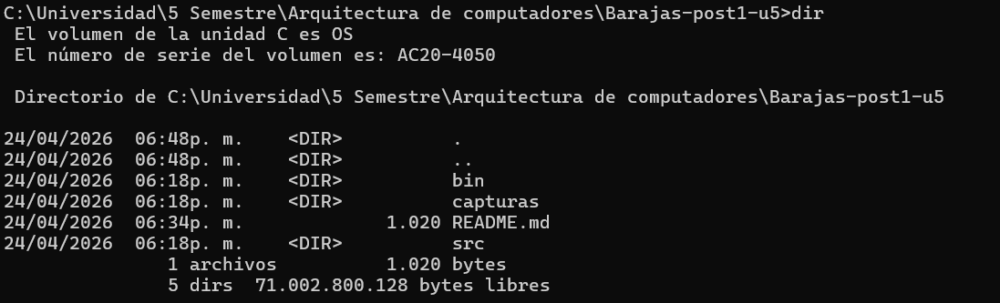
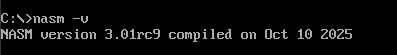
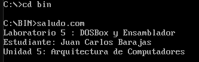
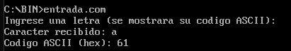
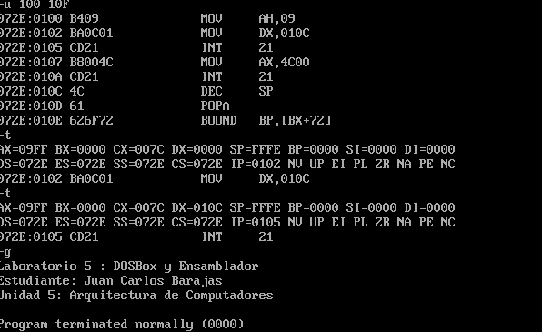

# Laboratorio: DOSBox: Entorno de Desarrollo en Ensamblador

**Estudiante:** Juan Carlos Barajas Quintero 
**Curso:** Arquitectura de Computadores - Unidad 5  
**Institución:** Universidad Francisco de Paula Santander

## Descripción del Laboratorio
El objetivo de esta actividad es configurar un entorno funcional en DOSBox para el desarrollo de programas en lenguaje ensamblador x86. Durante el laboratorio se escriben, ensamblan y ejecutan programas utilizando NASM, se verifica su comportamiento mediante la herramienta DEBUG de DOS y se documenta todo el proceso en un repositorio de GitHub.

## Entorno de Trabajo
Para el cumplimiento de los objetivos, se utilizó el siguiente software y versiones:
*   **Emulador:** DOSBox 0.74+.
*   **Ensamblador:** NASM versión 2.14+.
*   **Control de Versiones:** Git para la gestión del repositorio.
*   **Editor de Texto:** VS code para la escritura de los archivos .asm.

## Pasos Realizados

### Paso 1: Preparación del Directorio de Trabajo
Se creó la estructura de carpetas necesaria para organizar el proyecto: `src/` para los códigos fuente, `bin/` para los ejecutables y `capturas/` para las evidencias. Se inicializó el repositorio Git en la rama principal.

### Paso 2: Configuración de DOSBox
Se generó un archivo `dosbox.conf` personalizado para montar automáticamente el directorio del proyecto como la unidad `C:` y optimizar los ciclos de la CPU para el trabajo con NASM. Se verificó que el comando `nasm -v` funcionara correctamente dentro del entorno emulado.

### Paso 3: Salida de Texto (Programa 1)
Se desarrolló el programa `saludo.asm`, el cual utiliza la **función 09h de la interrupción 21h** de DOS para imprimir una cadena de texto terminada en `$`. El programa fue ensamblado como un archivo `.com` y ejecutado con éxito.

### Paso 4: Entrada de Teclado y Eco (Programa 2)
Se implementó `entrada.asm` para leer un carácter del teclado (función 07h de la INT 21h) y mostrar tanto el carácter como su código **ASCII en hexadecimal** en pantalla. Se utilizó una subrutina para convertir los nibbles a caracteres hexadecimales legibles.

### Paso 5: Verificación con DEBUG
Se utilizó el depurador **DEBUG** de DOS para analizar el programa `saludo.com` paso a paso. Mediante los comandos `-u` (desensamble) y `-t` (traza), se observaron los cambios en los registros `AX` y `DX` antes y después de las llamadas al sistema.

## 4. Resultados (Checkpoints)

| Checkpoint | Descripción | Evidencia |
| :--- | :--- | :--- |
| **1** | Estructura de directorios y Git inicializado |  |
| **2** | DOSBox operativo con NASM detectado |  |
| **3** | Ejecución exitosa de `saludo.com`|  |
| **4** | Interacción y eco hexadecimal en `entrada.com`|  |
| **5** | Sesión de depuración con comando `-u` y `-t` |  |

## 5. Conclusiones
*   La virtualización a través de **DOSBox** es una herramienta eficaz para estudiar arquitecturas heredadas de 16 bits en sistemas modernos, permitiendo un control total sobre el entorno de ejecución.
*   El uso de **interrupciones de DOS** facilita la interacción con el hardware y el sistema operativo, simplificando tareas de entrada/salida mediante funciones estandarizadas como la `INT 21h`.
*   El análisis con **DEBUG** refuerza la comprensión del ciclo de instrucción y el manejo de registros del procesador, permitiendo observar de forma tangible cómo el software afecta el estado del hardware en cada paso.

